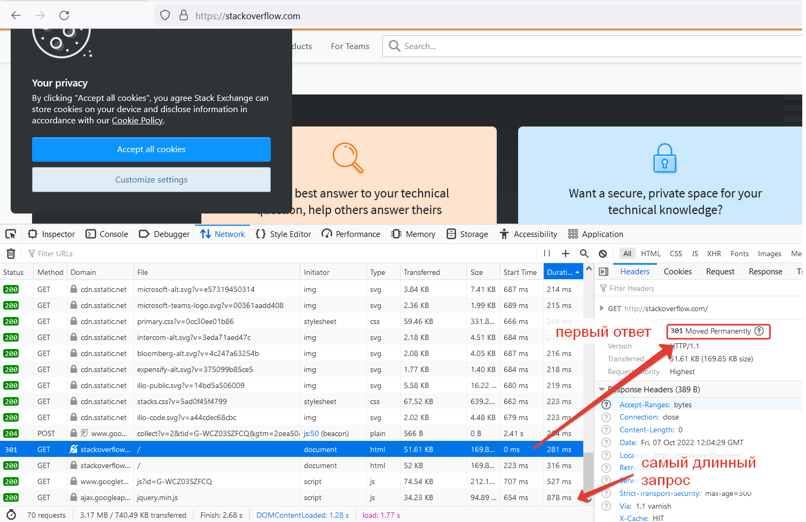

# Домашнее задание к занятию "3.6. Компьютерные сети, лекция 1"

1. Работа c HTTP через телнет.
   - Подключитесь утилитой телнет к сайту stackoverflow.com
   `telnet stackoverflow.com 80`
   - отправьте HTTP запрос
       ```bash
       GET /questions HTTP/1.0
       HOST: stackoverflow.com
       [press enter]
       [press enter]
       ```
   - В ответе укажите полученный HTTP код, что он означает?
    
    В ответе получен код HTTP/1.1 301 Moved Permanently
    код означает что запрошенный ресурс был перенесен на постоянной основе. В данном случае так реализовано перенаправление запросов http на https (https://stackoverflow.com/questions)

1. Повторите задание 1 в браузере, используя консоль разработчика F12.
   - откройте вкладку `Network`
   - отправьте запрос http://stackoverflow.com
   - найдите первый ответ HTTP сервера, откройте вкладку `Headers`
   - укажите в ответе полученный HTTP код.
   - проверьте время загрузки страницы, какой запрос обрабатывался дольше всего?
   - приложите скриншот консоли браузера в ответ.
   

1. Какой IP адрес у вас в интернете?
    ```bash
    root@vagrant:~# dig +short myip.opendns.com @resolver1.opendns.com
    109.173.41.113
    ```
    внешний айпи: 109.173.41.113

1. Какому провайдеру принадлежит ваш IP адрес? Какой автономной системе AS? Воспользуйтесь утилитой `whois`

    ```bash
    root@vagrant:~# whois  109.173.41.113
    % Information related to '109.173.0.0/18AS42610'
    ...
    route:          109.173.0.0/18
    descr:          NCNET
    origin:         AS42610
    mnt-by:         NCNET-MNT
    mnt-lower:      NCNET-MNT
    created:        2009-12-30T09:47:54Z
    last-modified:  2009-12-30T09:47:54Z
    source:         RIPE
    ```
    провайдер: NCNET
    AS:  AS42610
3. Через какие сети проходит пакет, отправленный с вашего компьютера на адрес 8.8.8.8? Через какие AS? Воспользуйтесь утилитой `traceroute`

    ```bash
    root@vagrant:~# traceroute -IA 8.8.8.8
    traceroute to 8.8.8.8 (8.8.8.8), 30 hops max, 60 byte packets
    1  _gateway (192.168.137.1) [*]  0.356 ms _gateway (10.0.2.2) [*]  0.154 ms _gateway (192.168.137.1) [*]  0.541 ms
    2  _gateway (192.168.137.1) [*]  1.455 ms *  1.412 ms
    3  * * *
    4  * 72.14.209.81 (72.14.209.81) [AS15169]  4.157 ms *
    5  209.85.250.231 (209.85.250.231) [AS15169]  3.821 ms *  3.800 ms
    6  72.14.198.182 (72.14.198.182) [AS15169]  5.359 ms 108.170.250.113 (108.170.250.113) [AS15169]  3.265 ms 72.14.198.182 (72.14.198.182) [AS15169]  3.723 ms
    7  216.239.51.32 (216.239.51.32) [AS15169]  18.275 ms 172.253.68.13 (172.253.68.13) [AS15169]  2.856 ms 216.239.51.32 (216.239.51.32) [AS15169]  18.428 ms
    8  108.170.250.113 (108.170.250.113) [AS15169]  3.816 ms 172.253.66.110 (172.253.66.110) [AS15169]  18.148 ms 108.170.250.113 (108.170.250.113) [AS15169]  3.799 ms
    9  216.239.58.65 (216.239.58.65) [AS15169]  21.733 ms 142.251.49.158 (142.251.49.158) [AS15169]  16.997 ms 216.239.58.65 (216.239.58.65) [AS15169]  21.682 ms
    10  108.170.235.204 (108.170.235.204) [AS15169]  19.645 ms *  19.596 ms
    11  * 216.239.63.65 (216.239.63.65) [AS15169]  19.378 ms *
    12  * * *
    13  * * *
    14  * * *
    15  * * *
    16  * * *
    17  * * *
    18  * * *
    19  * * *
    20  * * *
    21  dns.google (8.8.8.8) [AS15169]  16.755 ms  16.928 ms  16.925 ms
    ```
4. Повторите задание 5 в утилите `mtr`. На каком участке наибольшая задержка - delay?


    ```bash
    vagrant (192.168.137.115)                                                                                                   2022-10-07T12:53:33+0000
    Keys:  Help   Display mode   Restart statistics   Order of fields   quit
                                                                                                                Packets               Pings
    Host                                                                                                     Loss%   Snt   Last   Avg  Best  Wrst StDev
    1. AS???    192.168.137.1                                                                                 0.0%     2    0.6   0.7   0.6   0.8   0.1
    2. AS???    192.168.137.1                                                                                 0.0%     2    0.8   0.9   0.8   0.9   0.1
    3. AS42610  77.37.250.210                                                                                 0.0%     2    2.5   2.5   2.5   2.5   0.0
    4. (waiting for reply)
    5. AS15169  209.85.250.231                                                                                0.0%     2    2.9   3.0   2.9   3.2   0.2
    6. AS15169  72.14.198.182                                                                                 0.0%     2    3.9   4.0   3.9   4.1   0.1
    7. AS15169  216.239.51.32                                                                                 0.0%     2   18.6  18.5  18.5  18.6   0.1
    8. AS15169  108.170.250.113                                                                               0.0%     2    4.4   3.9   3.4   4.4   0.7
    9. AS15169  216.239.58.65                                                                                 0.0%     2   21.6  21.6  21.6  21.6   0.0
    10. AS15169  108.170.235.204                                                                               0.0%     2   19.4  19.5  19.4  19.7   0.2
    11. (waiting for reply)
    12. (waiting for reply)
    13. (waiting for reply)
    14. (waiting for reply)
    15. (waiting for reply)
    16. (waiting for reply)
    17. (waiting for reply)
    18. (waiting for reply)
    19. AS15169  8.8.8.8                                                                                       0.0%     2   19.5  19.9  19.5  20.2   0.4
    ```
    Наибольшая задержка на AS15169

5. Какие DNS сервера отвечают за доменное имя dns.google? Какие A записи? воспользуйтесь утилитой `dig`
    ```bash
    root@vagrant:~# dig dns.google NS

    ; <<>> DiG 9.16.1-Ubuntu <<>> dns.google NS
    ;; global options: +cmd
    ;; Got answer:
    ;; ->>HEADER<<- opcode: QUERY, status: NOERROR, id: 65393
    ;; flags: qr rd ra; QUERY: 1, ANSWER: 4, AUTHORITY: 0, ADDITIONAL: 1

    ;; OPT PSEUDOSECTION:
    ; EDNS: version: 0, flags:; udp: 65494
    ;; QUESTION SECTION:
    ;dns.google.                    IN      NS

    ;; ANSWER SECTION:
    dns.google.             21600   IN      NS      ns4.zdns.google.
    dns.google.             21600   IN      NS      ns1.zdns.google.
    dns.google.             21600   IN      NS      ns2.zdns.google.
    dns.google.             21600   IN      NS      ns3.zdns.google.

    ;; Query time: 28 msec
    ;; SERVER: 127.0.0.53#53(127.0.0.53)
    ;; WHEN: Fri Oct 07 13:00:43 UTC 2022
    ;; MSG SIZE  rcvd: 116

    root@vagrant:~# dig dns.google A

    ; <<>> DiG 9.16.1-Ubuntu <<>> dns.google A
    ;; global options: +cmd
    ;; Got answer:
    ;; ->>HEADER<<- opcode: QUERY, status: NOERROR, id: 55404
    ;; flags: qr rd ra; QUERY: 1, ANSWER: 2, AUTHORITY: 0, ADDITIONAL: 1

    ;; OPT PSEUDOSECTION:
    ; EDNS: version: 0, flags:; udp: 65494
    ;; QUESTION SECTION:
    ;dns.google.                    IN      A

    ;; ANSWER SECTION:
    dns.google.             385     IN      A       8.8.4.4
    dns.google.             385     IN      A       8.8.8.8

    ;; Query time: 0 msec
    ;; SERVER: 127.0.0.53#53(127.0.0.53)
    ;; WHEN: Fri Oct 07 13:00:58 UTC 2022
    ;; MSG SIZE  rcvd: 71
    ```
    NS-серверы: 
        ns4.zdns.google.
        ns1.zdns.google.
        ns2.zdns.google.
        ns3.zdns.google.
    A-записи:
        8.8.4.4
        8.8.8.8

6. Проверьте PTR записи для IP адресов из задания 7. Какое доменное имя привязано к IP? воспользуйтесь утилитой `dig`
    ```bash
    dig -x 8.8.8.8
    ;; ANSWER SECTION:
    8.8.8.8.in-addr.arpa.   6040    IN      PTR     dns.google.


    dig -x 8.8.4.4
    ;; ANSWER SECTION:
    4.4.8.8.in-addr.arpa.   19746   IN      PTR     dns.google.
    ```
